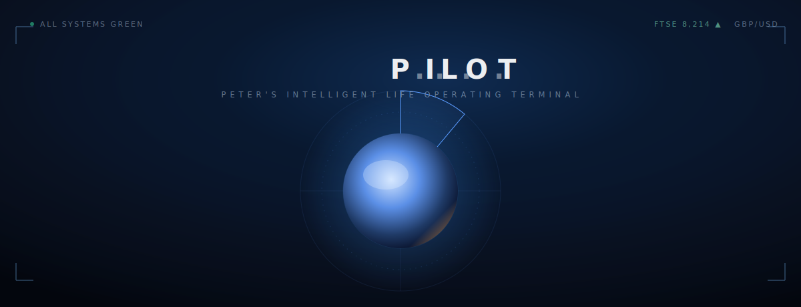

<div align="center">



# ✈️ PILOT

**Peter's Intelligent Life Operating Terminal**

A Jarvis-style AI command centre for **Peter Jones CBE** — voice-first, alive,
and built to surface decisions, not data. Think Tony Stark's J.A.R.V.I.S., but
for a man who runs 25+ portfolio companies instead of one suit.

<br/>

### [⬇  Download PILOT for macOS](https://github.com/1706hq/pilot/releases/latest)

*Apple Silicon · `.dmg` · open it, drag PILOT into Applications. It auto-updates from there.*

</div>

---

## What it is

PILOT doesn't replace Peter's judgement — it eliminates everything that wastes
it. Every morning it surfaces only what needs a decision; across the day it
answers questions, pulls up numbers, and **builds things on demand** —
invoices, briefs, dashboards — painted straight onto the canvas.

- **Voice-first.** The primary interaction is talking. The session auto-connects
  on launch — just speak. Text is the secondary path.
- **Renders UI on the fly.** Answers don't have to be words. Ask for an invoice,
  a KPI dashboard, or a one-page brief and PILOT builds it into the **Runway**
  (the right-hand panel) as it works.
- **Surfaces decisions, not data.** It reads everything and tells you what
  actually matters — never a wall of text (Peter is dyslexic: it speaks, the
  screen shows).
- **Vibe-first.** A live WebGL Orb, an aurora shader backdrop, a slow radar
  sweep, telemetry HUD and a staged launch sequence. It should *feel* like
  Jarvis — premium, low-latency, alive.

## The CREW

PILOT is the orchestrator. Behind it sits the **CREW** — specialist agent
personas, colour-coded for attribution:

| Agent | Role | Domain |
|------|------|--------|
| **PILOT** | Orchestrator | Synthesises the CREW, surfaces the brief |
| **STERLING** | CFO · Finance | Cash, P&L, margin — **invoices & reports** |
| **MARSHALL** | COO · Operations | KPIs, board packs — **dashboards** |

## Built with

- **[Tauri 2](https://tauri.app/)** (Rust shell) — native macOS window, OS access
- **[Next.js 16](https://nextjs.org/)** (App Router, static export) · **React 19** · **Tailwind v4**
- **[OGL](https://github.com/oframe/ogl)** — the WebGL Orb + DarkVeil shaders · **[motion](https://motion.dev/)** for animation
- **[ElevenLabs](https://elevenlabs.io/) Conversational AI** — voice · **Gemini Flash via [OpenRouter](https://openrouter.ai/)** — the LLM
- **zustand** for state · **@react-pdf/renderer** for invoices · local-first (on-device context, no external DB)

## Develop

```bash
npm install

# Configure keys in .env.local (gitignored) — see below

# Run in the browser (fast)
npm run dev                        # http://localhost:1420

# Run the native macOS app
npm run tauri dev
```

**Required env (`.env.local`):**

```
NEXT_PUBLIC_OPENROUTER_API_KEY=…
NEXT_PUBLIC_OPENROUTER_MODEL=google/gemini-3.5-flash
NEXT_PUBLIC_ELEVENLABS_API_KEY=…
NEXT_PUBLIC_ELEVENLABS_AGENT_ID=…
NEXT_PUBLIC_TWELVEDATA_KEY=…        # optional — powers the HUD "Market conditions" VIX readout (free tier)
```

## Build a release (DMG)

The macOS installer is produced by Tauri:

```bash
npm run tauri build
```

The signed `.dmg` lands in `src-tauri/target/release/bundle/dmg/`. Because the
app ships with the auto-updater enabled (`createUpdaterArtifacts`), the build
needs the updater signing key in the environment:

```bash
export TAURI_SIGNING_PRIVATE_KEY="…"          # or a path to the key file
export TAURI_SIGNING_PRIVATE_KEY_PASSWORD="…"
npm run tauri build
```

Publish the `.dmg`, the `.app.tar.gz` and `latest.json` to a GitHub **Release** —
installed copies update themselves from
[`releases/latest`](https://github.com/1706hq/pilot/releases/latest).

## Project layout

```
src/
  app/page.tsx          # the shell: 3 columns, launch sequence, HUD, voice auto-connect
  components/
    orb/                # OGL shader orb          home/radar.tsx   # radar sweep
    home/hud.tsx        # wordmark · telemetry · corner brackets
    home/output-sidebar # the "Runway" canvas
  pilot/
    agents/             # personas, orchestrator, canvas generation
    voice/              # ElevenLabs session + greetings
    state/              # zustand store + pilotState → visuals
    widgets/            # invoice / dashboard / chart / document cards
src-tauri/              # Rust shell, tauri.conf.json, DMG packaging
context/                # product, architecture, persona & gotchas docs
```

---

<div align="center"><sub>Built for Peter Jones. Your attitude determines your altitude.</sub></div>
